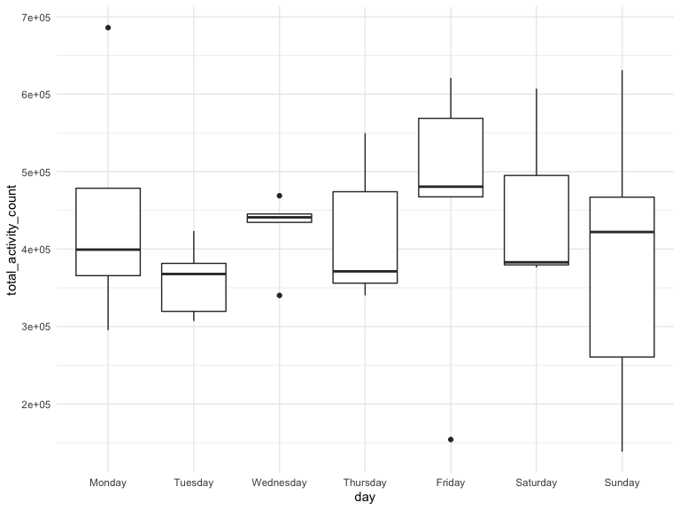
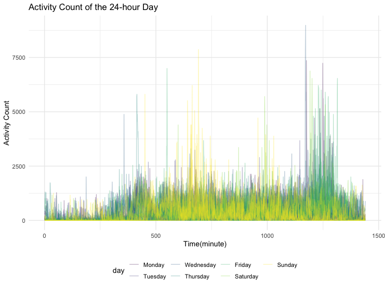

p8105_hw3_yj2752
================
Yixuan Jiao

``` r
library(tidyverse)
```

    ## ── Attaching packages ─────────────────────────────────────── tidyverse 1.3.2 ──
    ## ✔ ggplot2 3.3.6      ✔ purrr   0.3.4 
    ## ✔ tibble  3.1.8      ✔ dplyr   1.0.10
    ## ✔ tidyr   1.2.0      ✔ stringr 1.4.1 
    ## ✔ readr   2.1.2      ✔ forcats 0.5.2 
    ## ── Conflicts ────────────────────────────────────────── tidyverse_conflicts() ──
    ## ✖ dplyr::filter() masks stats::filter()
    ## ✖ dplyr::lag()    masks stats::lag()

``` r
library(patchwork)
library(p8105.datasets)

knitr::opts_chunk$set(
    echo = TRUE,
    warning = FALSE,
    fig.width = 8, 
  fig.height = 6,
  out.width = "90%"
)

theme_set(theme_minimal() + theme(legend.position = "bottom"))

options(
  ggplot2.continuous.colour = "viridis",
  ggplot2.continuous.fill = "viridis"
)

scale_colour_discrete = scale_colour_viridis_d
scale_fill_discrete = scale_fill_viridis_d
```

### Problem1

Load instacart dataset.

``` r
data("instacart")
```

See ordered aisle.

``` r
instacart %>%
  count(aisle) %>%
  arrange(desc(n))
```

    ## # A tibble: 134 × 2
    ##    aisle                              n
    ##    <chr>                          <int>
    ##  1 fresh vegetables              150609
    ##  2 fresh fruits                  150473
    ##  3 packaged vegetables fruits     78493
    ##  4 yogurt                         55240
    ##  5 packaged cheese                41699
    ##  6 water seltzer sparkling water  36617
    ##  7 milk                           32644
    ##  8 chips pretzels                 31269
    ##  9 soy lactosefree                26240
    ## 10 bread                          23635
    ## # … with 124 more rows

Plot aisle with number of items.

``` r
instacart %>% 
  count(aisle) %>% 
  filter(n > 10000) %>% 
  mutate(aisle = fct_reorder(aisle, n)) %>% 
  ggplot(aes(x = aisle, y = n)) + 
  geom_point() + 
  labs(title = "Number of items ordered in each aisle") +
  theme(axis.text.x = element_text(angle = 60, hjust = 1))
```


Order number of products in each of the three aisles.

``` r
instacart %>% 
  filter(aisle == "baking ingredients"|aisle == "dog food care"| aisle == "packaged vegetables fruits") %>% 
  group_by(aisle) %>%
  count(product_name) %>%
  mutate(rank = min_rank(desc(n))) %>%
  filter(rank < 4) %>%
  arrange(aisle,rank)
```

    ## # A tibble: 9 × 4
    ## # Groups:   aisle [3]
    ##   aisle                      product_name                                n  rank
    ##   <chr>                      <chr>                                   <int> <int>
    ## 1 baking ingredients         Light Brown Sugar                         499     1
    ## 2 baking ingredients         Pure Baking Soda                          387     2
    ## 3 baking ingredients         Cane Sugar                                336     3
    ## 4 dog food care              Snack Sticks Chicken & Rice Recipe Dog…    30     1
    ## 5 dog food care              Organix Chicken & Brown Rice Recipe        28     2
    ## 6 dog food care              Small Dog Biscuits                         26     3
    ## 7 packaged vegetables fruits Organic Baby Spinach                     9784     1
    ## 8 packaged vegetables fruits Organic Raspberries                      5546     2
    ## 9 packaged vegetables fruits Organic Blueberries                      4966     3

Show mean hour of order in each day of two products.

``` r
instacart %>%
  filter(product_name=="Pink Lady Apples"|product_name =="Coffee Ice Cream") %>%
  group_by(product_name,order_dow) %>%
  summarise(mean_hod = mean(order_hour_of_day)) %>%
  rename('Day' = order_dow) %>%
  pivot_wider(names_from = Day,values_from = mean_hod)
```

    ## `summarise()` has grouped output by 'product_name'. You can override using the
    ## `.groups` argument.

    ## # A tibble: 2 × 8
    ## # Groups:   product_name [2]
    ##   product_name       `0`   `1`   `2`   `3`   `4`   `5`   `6`
    ##   <chr>            <dbl> <dbl> <dbl> <dbl> <dbl> <dbl> <dbl>
    ## 1 Coffee Ice Cream  13.8  14.3  15.4  15.3  15.2  12.3  13.8
    ## 2 Pink Lady Apples  13.4  11.4  11.7  14.2  11.6  12.8  11.9

``` r
  #spread(key = Day, value = mean_hod)
```

### Problem2

Firstly, load the dataset using `read_csv()`

``` r
accel_data <- read_csv('data/accel_data.csv') %>% janitor::clean_names()
```

    ## Rows: 35 Columns: 1443
    ## ── Column specification ────────────────────────────────────────────────────────
    ## Delimiter: ","
    ## chr    (1): day
    ## dbl (1442): week, day_id, activity.1, activity.2, activity.3, activity.4, ac...
    ## 
    ## ℹ Use `spec()` to retrieve the full column specification for this data.
    ## ℹ Specify the column types or set `show_col_types = FALSE` to quiet this message.

Use `pivot_longer()` to make the table tidy. Column `minute` would store
the information of minute and `activity_count` would store the activity
count for each minute of the day. I also add a column storing the
information for weekend vs. weekday, that the weekends would be stored
as TRUE while weekdays as FALSE. Then I convert `day` to factor so that
it could be ordered from Monday to Sunday instead of in alphabetical
order. Also `minute` is converted into numeric class.

``` r
accel_data_tidy <- 
  accel_data %>%
  pivot_longer(starts_with('activity'),
               names_to = 'minute',
               names_prefix = 'activity_',
               values_to = 'activity_count') %>%
  mutate(weekend = ifelse(day %in% c('Saturday','Sunday'),TRUE,FALSE)) %>%
  mutate(day = factor(day,levels = c('Monday','Tuesday','Wednesday','Thursday','Friday','Saturday','Sunday'))) %>%
  mutate(minute = as.numeric(minute))
```

In total there are 6 variables and 50400 observations. Then, a table
containing total activity count of each day is created. First use
`group_by()` to select each single day by grouping both `week` and
`day`, then use `summarise()` to add up all activity counts in one day.
Lastly, use `pivot_wider()` to transfer the table into format that is
more readable to human.

``` r
accel_data_tidy %>%
  group_by(week,day) %>%
  summarise(total_activity_count = sum(activity_count)) %>%
  pivot_wider(names_from = day, values_from = total_activity_count) %>%
  knitr::kable(digit = 0)
```

    ## `summarise()` has grouped output by 'week'. You can override using the
    ## `.groups` argument.

| week | Monday | Tuesday | Wednesday | Thursday | Friday | Saturday | Sunday |
|-----:|-------:|--------:|----------:|---------:|-------:|---------:|-------:|
|    1 |  78828 |  307094 |    340115 |   355924 | 480543 |   376254 | 631105 |
|    2 | 295431 |  423245 |    440962 |   474048 | 568839 |   607175 | 422018 |
|    3 | 685910 |  381507 |    468869 |   371230 | 467420 |   382928 | 467052 |
|    4 | 409450 |  319568 |    434460 |   340291 | 154049 |     1440 | 260617 |
|    5 | 389080 |  367824 |    445366 |   549658 | 620860 |     1440 | 138421 |

There are some data points that is special in the table. Saturdays of
week 4 and 5 only have 1440 counts (exact 1 for each minute all day) and
that could be possibly caused by operation error. And the first day has
far less counts comparing with other Mondays, that could possibly mean
the man start wearing the accelerator half way of the day. So I would
filtering those points off when doing the analysis by setting threshold
total_activity_count \> 100000.

Grouping by weekdays and weekends, we can see the average activity count
of weekend is slightly less than weekday.

``` r
accel_data_tidy %>%
  group_by(week,day,weekend) %>%
  summarise(total_activity_count = sum(activity_count)) %>%
  filter(total_activity_count > 100000) %>%
  group_by(weekend) %>%
  summarise(mean_activity_count = mean(total_activity_count))
```

    ## # A tibble: 2 × 2
    ##   weekend mean_activity_count
    ##   <lgl>                 <dbl>
    ## 1 FALSE               420489.
    ## 2 TRUE                410696.

By plotting a box plot showing each day’s distribution of total activity
counts, the trend seems to be that the total activity count would reach
the peak when Friday of each week.

``` r
accel_data_tidy %>%
  group_by(week,day) %>%
  summarise(total_activity_count = sum(activity_count)) %>%
  filter(total_activity_count > 100000) %>%
  ggplot(aes(x = day,y = total_activity_count)) +
  geom_boxplot()
```



Use `ggplot()` to draw a plot showing the activity of each minute during
a 24-day. The color of the plot represents the day of the week. Based on
the graph, I can see there are several peaks over the day that indicates
the individual tends to move more during those moment. Also, different
days of the week might have different peak pattern (difference of peak
in weekends). The first peak is around 400 minutes(possibly wake up and
morning routine), 2nd peak is around noon (this peak is majorly for
Sunday, and this might be the Sunday wake up time), 3rd and 4th peak is
around 1000 and 1200. The activity at night(0-300) is less than the day
time because of the sleep.

``` r
accel_data_tidy %>%
  ggplot(aes(x = minute,y = activity_count, color = day)) +
  geom_point(aes(alpha = 0.5)) +
  labs(x = 'Time(minute)', y = 'Activity Count', title = 'Activity Count of the 24-hour Day')
```



### Problem3

Load ny_noaa data

``` r
data("ny_noaa")
```

Use skimr to see the summary of the whole dataset

``` r
skimr::skim(ny_noaa)
```

|                                                  |         |
|:-------------------------------------------------|:--------|
| Name                                             | ny_noaa |
| Number of rows                                   | 2595176 |
| Number of columns                                | 7       |
| \_\_\_\_\_\_\_\_\_\_\_\_\_\_\_\_\_\_\_\_\_\_\_   |         |
| Column type frequency:                           |         |
| character                                        | 3       |
| Date                                             | 1       |
| numeric                                          | 3       |
| \_\_\_\_\_\_\_\_\_\_\_\_\_\_\_\_\_\_\_\_\_\_\_\_ |         |
| Group variables                                  | None    |

Data summary

**Variable type: character**

| skim_variable | n_missing | complete_rate | min | max | empty | n_unique | whitespace |
|:--------------|----------:|--------------:|----:|----:|------:|---------:|-----------:|
| id            |         0 |          1.00 |  11 |  11 |     0 |      747 |          0 |
| tmax          |   1134358 |          0.56 |   1 |   4 |     0 |      532 |          0 |
| tmin          |   1134420 |          0.56 |   1 |   4 |     0 |      548 |          0 |

**Variable type: Date**

| skim_variable | n_missing | complete_rate | min        | max        | median     | n_unique |
|:--------------|----------:|--------------:|:-----------|:-----------|:-----------|---------:|
| date          |         0 |             1 | 1981-01-01 | 2010-12-31 | 1997-01-21 |    10957 |

**Variable type: numeric**

| skim_variable | n_missing | complete_rate |  mean |     sd |  p0 | p25 | p50 | p75 |  p100 | hist  |
|:--------------|----------:|--------------:|------:|-------:|----:|----:|----:|----:|------:|:------|
| prcp          |    145838 |          0.94 | 29.82 |  78.18 |   0 |   0 |   0 |  23 | 22860 | ▇▁▁▁▁ |
| snow          |    381221 |          0.85 |  4.99 |  27.22 | -13 |   0 |   0 |   0 | 10160 | ▇▁▁▁▁ |
| snwd          |    591786 |          0.77 | 37.31 | 113.54 |   0 |   0 |   0 |   0 |  9195 | ▇▁▁▁▁ |

Temperature(max and min), precipitation, and snow are measured by
different station over decades. There are in total 7 variables and
2595176 observations. There are 3 columns character type (temperature
should be transfer to numeric type). There are many missing values in
columns except id and date and that might cause problem when generating
the plot.
